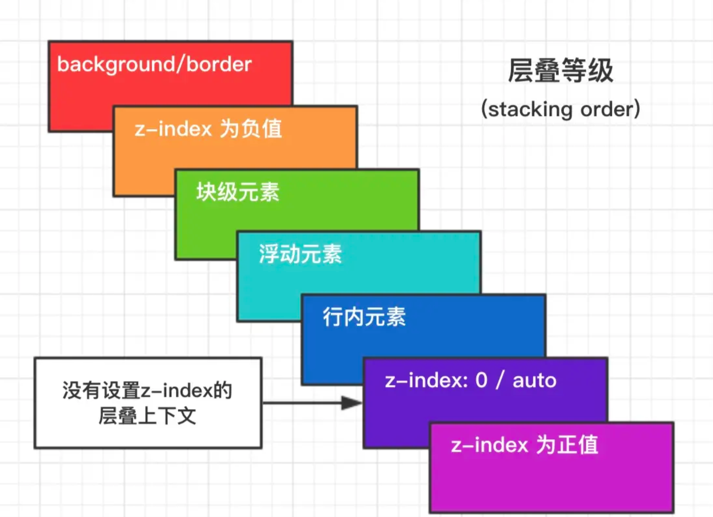

### 1. 盒模型

> 介绍一下标准的CSS的盒子模型？低版本IE的盒子模型有什么不同的？
>
> （1）有两种， IE 盒子模型、W3C 盒子模型； 
>
> （2）盒模型： 内容(content)、填充(padding)、边界(margin)、 边框(border)；
>
> （3）区  别： IE的content部分把 border 和 padding计算了进去;

页面渲染时，dom 元素所采用的 **布局模型**。可通过`box-sizing`进行设置。根据计算宽高的区域可分为：

- `content-box` (W3C 标准盒模型)
- `border-box` (IE 盒模型)
- `padding-box` (FireFox 曾经支持)
- `margin-box` (浏览器未实现)

> Tips: 理论上是有上面 4 种盒子，但现在 w3c 与 mdn 规范中均只支持 `content-box` 与 `border-box`；

### 2. BFC

**块级格式化上下文**，是一个独立的渲染区域，让处于 BFC 内部的元素与外部的元素相互隔离，使内外元素的定位不会相互影响。

> IE下为 Layout，可通过 zoom:1 触发

- 触发条件:
  - 根元素
  - `position: absolute/fixed`
  - `display: inline-block / table`
  - `float` 元素
  - `ovevflow` !== `visible`
  
- 规则:
  - 属于同一个 BFC 的两个相邻 Box 垂直排列
  - 属于同一个 BFC 的两个相邻 Box 的 margin 会发生重叠
  - BFC 中子元素的 margin box 的左边， 与包含块 (BFC) border box的左边相接触 (子元素 absolute 除外)
  - BFC 的区域不会与 float 的元素区域重叠
  - 计算 BFC 的高度时，浮动子元素也参与计算
  - 文字层不会被浮动层覆盖，环绕于周围
  
- 应用:
  - 阻止`margin`重叠
  - 可以包含浮动元素 —— 清除内部浮动(清除浮动的原理是两个`div`都位于同一个 BFC 区域之中)
  - 自适应两栏布局
  - 可以阻止元素被浮动元素覆盖
  
- 对BFC规范(块级格式化上下文：block formatting context)的理解？

  ```
  （W3C CSS 2.1 规范中的一个概念,它是一个独立容器，决定了元素如何对其内容进行定位,以及与其他元素的关系和相互作用。）
   一个页面是由很多个 Box 组成的,元素的类型和 display 属性,决定了这个 Box 的类型。
   不同类型的 Box,会参与不同的 Formatting Context（决定如何渲染文档的容器）,因此Box内的元素会以不同的方式渲染,也就是说BFC内部的元素和外部的元素不会互相影响。
  复制代码
  ```


  

### 3.层叠上下文

元素提升为一个比较特殊的图层，在三维空间中 **(z轴)** 高出普通元素一等。

- 触发条件
  - 根层叠上下文(`html`)
  - `position`
  - css3属性
    - `flex`
    - `transform`
    - `opacity`
    - `filter`
    - `will-change`
    - `-webkit-overflow-scrolling`
- 层叠等级：层叠上下文在z轴上的排序
  - 在同一层叠上下文中，层叠等级才有意义
  - `z-index`的优先级最高





### 4. 居中布局

- 水平居中
  - 行内元素: `text-align: center`
  - 块级元素: `margin: 0 auto`
  - `absolute + transform`
  - `flex + justify-content: center`
- 垂直居中
  - `line-height: height`
  - `absolute + transform`
  - `flex + align-items: center`
  - `table`
- 水平垂直居中
  - `absolute + transform`
  - `flex + justify-content + align-items`

### 5. 选择器优先级

- `!important` > 行内样式 > `#id` > `.class` > `tag` > * > 继承 > 默认

- 选择器 **从右往左** 解析

- > \*   优先级就近原则，同权重情况下样式定义最近者为准; 
  >
  > * 载入样式以最后载入的定位为准; 优先级为:   !important >  id > class > tag    
  > * important 比 内联优先级高

### 6.去除浮动影响，防止父级高度塌陷

- 通过增加尾元素清除浮动
  - `:after / <br> : clear: both`
- 创建父级 BFC
- 父级设置高度

### 7.link 与 @import 的区别

- `link`功能较多，可以定义 RSS，定义 Rel 等作用，而`@import`只能用于加载 css
- 当解析到`link`时，页面会同步加载所引的 css，而`@import`所引用的 css 会等到页面加载完才被加载
- `@import`需要 IE5 以上才能使用
- `link`可以使用 js 动态引入，`@import`不行

### 8. CSS预处理器(Sass/Less/Postcss)

CSS预处理器的原理: 是将类 CSS 语言通过 **Webpack 编译** 转成浏览器可读的真正 CSS。在这层编译之上，便可以赋予 CSS 更多更强大的功能，常用功能:

- 嵌套
- 变量
- 循环语句
- 条件语句
- 自动前缀
- 单位转换
- mixin复用

面试中一般不会重点考察该点，一般介绍下自己在实战项目中的经验即可~

> 什么是CSS 预处理器 / 后处理器？
>
> ```
> - 预处理器例如：LESS、Sass、Stylus，用来预编译Sass或less，增强了css代码的复用性，
>   还有层级、mixin、变量、循环、函数等，具有很方便的UI组件模块化开发能力，极大的提高工作效率。
> 
> - 后处理器例如：PostCSS，通常被视为在完成的样式表中根据CSS规范处理CSS，让其更有效；目前最常做的
>   是给CSS属性添加浏览器私有前缀，实现跨浏览器兼容性的问题。
> ```

### 9.CSS动画

- `transition`: 过渡动画

  - `transition-property`: 属性
  - `transition-duration`: 间隔
  - `transition-timing-function`: 曲线
  - `transition-delay`: 延迟
  - 常用钩子: `transitionend`

- `animation / keyframes`

  - `animation-name`: 动画名称，对应`@keyframes`

  - `animation-duration`: 间隔

  - `animation-timing-function`: 曲线

  - `animation-delay`: 延迟

  - ```
    animation-iteration-count
    ```

    : 次数

    - `infinite`: 循环动画

  - ```
    animation-direction
    ```

    : 方向

    - `alternate`: 反向播放

  - ```
    animation-fill-mode
    ```

    : 静止模式

    - `forwards`: 停止时，保留最后一帧
    - `backwards`: 停止时，回到第一帧
    - `both`: 同时运用 `forwards / backwards`

  - 常用钩子: `animationend`

- 动画属性: 尽量使用动画属性进行动画，能拥有较好的性能表现

  - `translate`
  - `scale`
  - `rotate`
  - `skew`
  - `opacity`
  - `color`


### 10. CSS选择符有哪些？哪些属性可以继承？

```css
*   1.id选择器（ # myid）
    2.类选择器（.myclassname）
    3.标签选择器（div, h1, p）
    4.相邻选择器（h1 + p）
    5.子选择器（ul > li）
    6.后代选择器（li a）
    7.通配符选择器（ * ）
    8.属性选择器（a[rel = "external"]）
    9.伪类选择器（a:hover, li:nth-child）

*   可继承的样式： font-size font-family color, UL LI DL DD DT;

*   不可继承的样式：border padding margin width height ;
```


### 11. CSS3新增伪类有那些？

```css
    举例：
    p:first-of-type 选择属于其父元素的首个  元素的每个  元素。
    p:last-of-type  选择属于其父元素的最后  元素的每个  元素。
    p:only-of-type  选择属于其父元素唯一的  元素的每个  元素。
    p:only-child        选择属于其父元素的唯一子元素的每个  元素。
    p:nth-child(2)  选择属于其父元素的第二个子元素的每个  元素。

    :after          在元素之前添加内容,也可以用来做清除浮动。
    :before         在元素之后添加内容
    :enabled        
    :disabled       控制表单控件的禁用状态。
    :checked        单选框或复选框被选中。

```

### 12. CSS3有哪些新特性？

CSS3有哪些新特性？

```css
  新增各种CSS选择器    （: not(.input)：所有 class 不是“input”的节点）
  圆角           （border-radius:8px）
  多列布局        （multi-column layout）
  阴影和反射      （Shadow\Reflect）
  文字特效      （text-shadow、）
  文字渲染      （Text-decoration）
  线性渐变      （gradient）
  旋转          （transform）
  增加了旋转,缩放,定位,倾斜,动画，多背景
  transform:\scale(0.85,0.90)\ translate(0px,-30px)\ skew(-9deg,0deg)\Animation:
复制代码
```

### 13. 经常遇到的浏览器的兼容性有哪些？原因，解决方法是什么，常用hack的技巧 ？

```css
* png24位的图片在iE6浏览器上出现背景，解决方案是做成PNG8.

* 浏览器默认的margin和padding不同。解决方案是加一个全局的*{margin:0;padding:0;}来统一。

* IE6双边距bug:块属性标签float后，又有横行的margin情况下，在ie6显示margin比设置的大。

  浮动ie产生的双倍距离 #box{ float:left; width:10px; margin:0 0 0 100px;}

  这种情况之下IE会产生20px的距离，解决方案是在float的标签样式控制中加入 ——_display:inline;将其转化为行内属性。(_这个符号只有ie6会识别)

  渐进识别的方式，从总体中逐渐排除局部。

  首先，巧妙的使用“\9”这一标记，将IE游览器从所有情况中分离出来。
  接着，再次使用“+”将IE8和IE7、IE6分离开来，这样IE8已经独立识别。

  css
      .bb{
          background-color:#f1ee18;/*所有识别*/
          .background-color:#00deff\9; /*IE6、7、8识别*/
          +background-color:#a200ff;/*IE6、7识别*/
          _background-color:#1e0bd1;/*IE6识别*/
      }

*  IE下,可以使用获取常规属性的方法来获取自定义属性,
   也可以使用getAttribute()获取自定义属性;
   Firefox下,只能使用getAttribute()获取自定义属性。
   解决方法:统一通过getAttribute()获取自定义属性。

*  IE下,even对象有x,y属性,但是没有pageX,pageY属性;
   Firefox下,event对象有pageX,pageY属性,但是没有x,y属性。

*  解决方法：（条件注释）缺点是在IE浏览器下可能会增加额外的HTTP请求数。

*  Chrome 中文界面下默认会将小于 12px 的文本强制按照 12px 显示,
   可通过加入 CSS 属性 -webkit-text-size-adjust: none; 解决。

超链接访问过后hover样式就不出现了 被点击访问过的超链接样式不在具有hover和active了解决方法是改变CSS属性的排列顺序:
L-V-H-A :  a:link {} a:visited {} a:hover {} a:active {}

```

### 14. li与li之间有看不见的空白间隔是什么原因引起的？有什么解决办法？

```
行框的排列会受到中间空白（回车\空格）等的影响，因为空格也属于字符,这些空白也会被应用样式，占据空间，所以会有间隔，把字符大小设为0，就没有空格了。

```

### 15. 为什么要初始化CSS样式。

```css
- 因为浏览器的兼容问题，不同浏览器对有些标签的默认值是不同的，如果没对CSS初始化往往会出现浏览器之间的页面显示差异。

- 当然，初始化样式会对SEO有一定的影响，但鱼和熊掌不可兼得，但力求影响最小的情况下初始化。

最简单的初始化方法： * {padding: 0; margin: 0;} （强烈不建议）

淘宝的样式初始化代码：
body, h1, h2, h3, h4, h5, h6, hr, p, blockquote, dl, dt, dd, ul, ol, li, pre, form, fieldset, legend, button, input, textarea, th, td { margin:0; padding:0; }
body, button, input, select, textarea { font:12px/1.5tahoma, arial, \5b8b\4f53; }
h1, h2, h3, h4, h5, h6{ font-size:100%; }
address, cite, dfn, em, var { font-style:normal; }
code, kbd, pre, samp { font-family:couriernew, courier, monospace; }
small{ font-size:12px; }
ul, ol { list-style:none; }
a { text-decoration:none; }
a:hover { text-decoration:underline; }
sup { vertical-align:text-top; }
sub{ vertical-align:text-bottom; }
legend { color:#000; }
fieldset, img { border:0; }
button, input, select, textarea { font-size:100%; }
table { border-collapse:collapse; border-spacing:0; }
复制代码
```

### 16. absolute的containing block(容器块)计算方式跟正常流有什么不同？

```css
无论属于哪种，都要先找到其祖先元素中最近的 position 值不为 static 的元素，然后再判断：
1、若此元素为 inline 元素，则 containing block 为能够包含这个元素生成的第一个和最后一个 inline box 的 padding box (除 margin, border 外的区域) 的最小矩形；
2、否则,则由这个祖先元素的 padding box 构成。
如果都找不到，则为 initial containing block。

补充：
1. static(默认的)/relative：简单说就是它的父元素的内容框（即去掉padding的部分）
2. absolute: 向上找最近的定位为absolute/relative的元素
3. fixed: 它的containing block一律为根元素(html/body)，根元素也是initial containing block
复制代码
```

### 17. CSS里的visibility属性有个collapse属性值是干嘛用的？在不同浏览器下以后什么区别？

### 18. position跟display、margin collapse、overflow、float这些特性相互叠加后会怎么样？


### 经验

通常，CSS 并不是重点的考察领域，但这其实是由于现在国内业界对 CSS 的专注不够导致的，真正精通并专注于 CSS 的团队和人才并不多。因此如果能在 CSS 领域有自己的见解和经验，反而会为相当的加分和脱颖而出。


