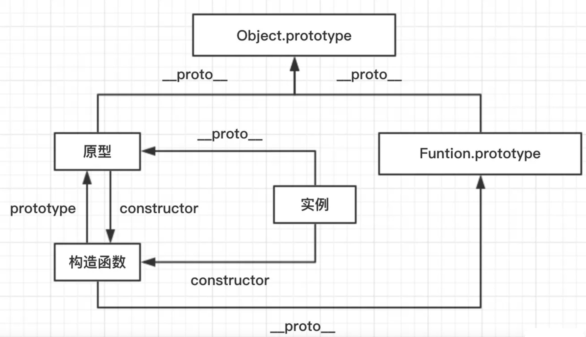
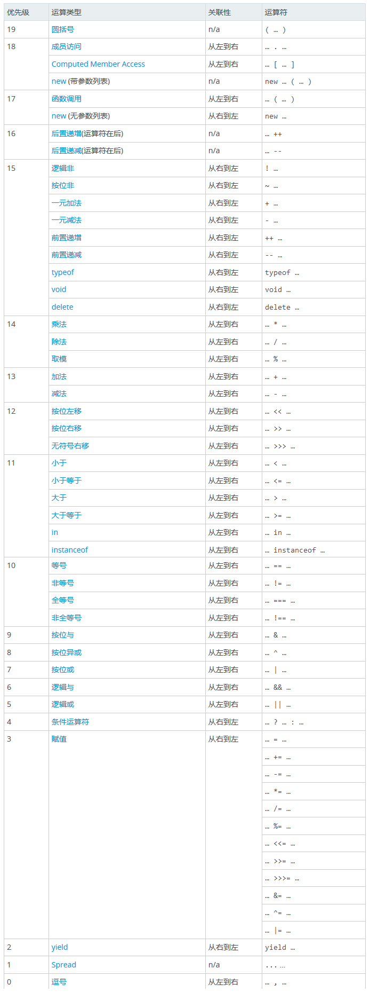
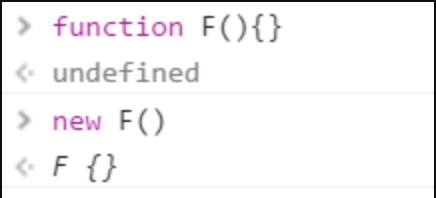
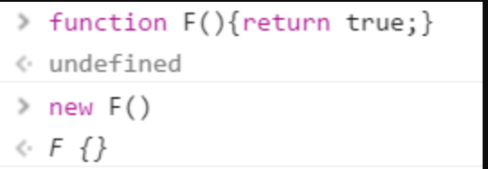
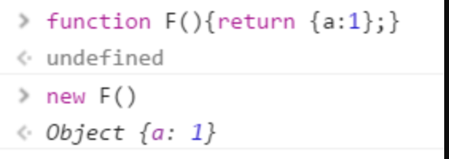

### 1. 原型 / 构造函数 / 实例

- 原型`(prototype)`: 一个简单的对象，用于实现对象的 **属性继承**。可以简单的理解成对象的爹。在 Firefox 和 Chrome 中，每个`JavaScript`对象中都包含一个`__proto__` (非标准)的属性指向它爹(该对象的原型)，可`obj.__proto__`进行访问。
- 构造函数: 可以通过`new`来 **新建一个对象** 的函数。
- 实例: 通过构造函数和`new`创建出来的对象，便是实例。 **实例通过`__proto__`指向原型，通过`constructor`指向构造函数**。

说了一大堆，大家可能有点懵逼，这里来举个栗子，以`Object`为例，我们常用的`Object`便是一个构造函数，因此我们可以通过它构建实例。

```js
// 实例
const instance = new Object()
复制代码
```

则此时， **实例为`instance`**, **构造函数为`Object`**，我们知道，构造函数拥有一个`prototype`的属性指向原型，因此原型为:

```js
// 原型
const prototype = Object.prototype
复制代码
```

这里我们可以来看出三者的关系:

```js
实例.__proto__ === 原型

原型.constructor === 构造函数

构造函数.prototype === 原型

// 这条线其实是是基于原型进行获取的，可以理解成一条基于原型的映射线
// 例如: 
// const o = new Object()
// o.constructor === Object   --> true
// o.__proto__ = null;
// o.constructor === Object   --> false
// 注意: 其实实例上并不是真正有 constructor 这个指针，它其实是从原型链上获取的
//      instance.hasOwnProperty('constructor') === false   (感谢 刘博海 Brian 童鞋🥳)
实例.constructor === 构造函数
复制代码
```

> 此处感谢 caihaihong 童鞋的指出。

放大来看，我画了张图供大家彻底理解:





### 2.原型链：

**原型链是由原型对象组成**，每个对象都有 `__proto__` 属性，指向了创建该对象的构造函数的原型，`__proto__` 将对象连接起来组成了原型链。是一个用来**实现继承和共享属性**的有限的对象链。

- **属性查找机制**: 当查找对象的属性时，如果实例对象自身不存在该属性，则沿着原型链往上一级查找，找到时则输出，不存在时，则继续沿着原型链往上一级查找，直至最顶级的原型对象`Object.prototype`，如还是没找到，则输出 `undefined`；

- **属性修改机制**: 只会修改实例对象本身的属性，如果不存在，则进行添加该属性，如果需要修改原型的属性时，则可以用: `b.prototype.x = 2`；但是这样会造成所有继承于该对象的实例的属性发生改变。

- ######  ** JavaScript原型，原型链 ? 有什么特点？**

  ```js
  每个对象都会在其内部初始化一个属性，就是prototype(原型)，当我们访问一个对象的属性时，
  如果这个对象内部不存在这个属性，那么他就会去prototype里找这个属性，这个prototype又会有自己的prototype，
  于是就这样一直找下去，也就是我们平时所说的原型链的概念。
  关系：instance.constructor.prototype = instance.__proto__
  
  特点：
  JavaScript对象是通过引用来传递的，我们创建的每个新对象实体中并没有一份属于自己的原型副本。当我们修改原型时，与之相关的对象也会继承这一改变。
  
   当我们需要一个属性的时，Javascript引擎会先看当前对象中是否有这个属性， 如果没有的话，
   就会查找他的Prototype对象是否有这个属性，如此递推下去，一直检索到 Object 内建对象。
      function Func(){}
      Func.prototype.name = "Sean";
      Func.prototype.getInfo = function() {
        return this.name;
      }
      var person = new Func();//现在可以参考var person = Object.create(oldObject);
      console.log(person.getInfo());//它拥有了Func的属性和方法
      //"Sean"
      console.log(Func.prototype);
      // Func { name="Sean", getInfo=function()}
  
  ```

  

### 3. 执行上下文(EC)

执行上下文可以简单理解为一个对象:

- 它包含三个部分:
  - 变量对象(VO)
  - 作用域链(词法作用域)
  - `this`指向
- 它的类型:
  - 全局执行上下文
  - 函数执行上下文
  - `eval`执行上下文
- 代码执行过程:
  - 创建 **全局上下文** (global EC)
  - 全局执行上下文 (caller) 逐行 **自上而下** 执行。遇到函数时，**函数执行上下文** (callee) 被`push`到执行栈顶层
  - 函数执行上下文被激活，成为 active EC, 开始执行函数中的代码，caller 被挂起
  - 函数执行完后，callee 被`pop`移除出执行栈，控制权交还全局上下文 (caller)，继续执行

### 2.变量对象

变量对象，是执行上下文中的一部分，可以抽象为一种 **数据作用域**，其实也可以理解为就是一个简单的对象，它存储着该执行上下文中的所有 **变量和函数声明(不包含函数表达式)**。

> 活动对象 (AO): 当变量对象所处的上下文为 active EC 时，称为活动对象。

### 3. 作用域

执行上下文中还包含作用域链。理解作用域之前，先介绍下作用域。作用域其实可理解为该上下文中声明的 **变量和声明的作用范围**。可分为 **块级作用域** 和 **函数作用域**

特性:

- **声明提前**: 一个声明在函数体内都是可见的, 函数优先于变量
- 非匿名自执行函数，函数变量为 **只读** 状态，无法修改

```js
let foo = function() { console.log(1) };
(function foo() {
    foo = 10  // 由于foo在函数中只为可读，因此赋值无效
    console.log(foo)
}()) 

// 结果打印：  ƒ foo() { foo = 10 ; console.log(foo) }
复制代码
```

### 4.作用域链

我们知道，我们可以在执行上下文中访问到父级甚至全局的变量，这便是作用域链的功劳。作用域链可以理解为一组对象列表，包含 **父级和自身的变量对象**，因此我们便能通过作用域链访问到父级里声明的变量或者函数。

- 由两部分组成:
  - `[[scope]]`属性: 指向父级变量对象和作用域链，也就是包含了父级的`[[scope]]`和`AO`
  - AO: 自身活动对象

如此 `[[scopr]]`包含`[[scope]]`，便自上而下形成一条 **链式作用域**。

> Javascript作用链域?
>
> ```
> 全局函数无法查看局部函数的内部细节，但局部函数可以查看其上层的函数细节，直至全局细节。
> 当需要从局部函数查找某一属性或方法时，如果当前作用域没有找到，就会上溯到上层作用域查找，
> 直至全局函数，这种组织形式就是作用域链。
> 
> ```

### 5. 闭包

闭包属于一种特殊的作用域，称为 **静态作用域**。它的定义可以理解为: **父函数被销毁** 的情况下，返回出的子函数的`[[scope]]`中仍然保留着父级的单变量对象和作用域链，因此可以继续访问到父级的变量对象，这样的函数称为闭包。

- 闭包会产生一个很经典的问题:
  - 多个子函数的`[[scope]]`都是同时指向父级，是完全共享的。因此当父级的变量对象被修改时，所有子函数都受到影响。
- 解决:
  - 变量可以通过 **函数参数的形式** 传入，避免使用默认的`[[scope]]`向上查找
  - 使用`setTimeout`包裹，通过第三个参数传入
  - 使用 **块级作用域**，让变量成为自己上下文的属性，避免共享

### 6. script 引入方式：

- html 静态`<script>`引入
- js 动态插入`<script>`
- `<script defer>`: 延迟加载，元素解析完成后执行
- `<script async>`: 异步加载，但执行时会阻塞元素渲染

### 7. 对象的拷贝

- 浅拷贝: 以赋值的形式拷贝引用对象，仍指向同一个地址，**修改时原对象也会受到影响**

  - `Object.assign`
  - 展开运算符(...)

- 深拷贝: 完全拷贝一个新对象，**修改时原对象不再受到任何影响**

  - ```js
    JSON.parse(JSON.stringify(obj))
    ```

    : 性能最快

    - 具有循环引用的对象时，报错
    - 当值为函数、`undefined`、或`symbol`时，无法拷贝

  - 递归进行逐一赋值

### 8. new运算符的执行过程

- 新生成一个对象
- 链接到原型:  `obj.__proto__ = Con.prototype`
- 绑定this: `apply`
- 返回新对象(如果构造函数有自己 retrun 时，则返回该值)

### 9. instanceof原理

能在实例的 **原型对象链** 中找到该构造函数的`prototype`属性所指向的 **原型对象**，就返回`true`。即:

```js
// __proto__: 代表原型对象链
instance.[__proto__...] === instance.constructor.prototype

// return true
复制代码
```

### 10. 代码的复用

当你发现任何代码开始写第二遍时，就要开始考虑如何复用。一般有以下的方式:

- 函数封装
- 继承
- 复制`extend`
- 混入`mixin`
- 借用`apply/call`

### 11. 继承

在 JS 中，继承通常指的便是 **原型链继承**，也就是通过指定原型，并可以通过原型链继承原型上的属性或者方法。

- 最优化: **圣杯模式**

```js
var inherit = (function(c,p){
	var F = function(){};
	return function(c,p){
		F.prototype = p.prototype;
		c.prototype = new F();
		c.uber = p.prototype;
		c.prototype.constructor = c;
	}
})();

```

- 使用 ES6 的语法糖 `class / extends`

- Javascript如何实现继承？

  ```
  1、构造继承
  2、原型继承
  3、实例继承
  4、拷贝继承
  
  原型prototype机制或apply和call方法去实现较简单，建议使用构造函数与原型混合方式。
  
   function Parent(){
          this.name = 'wang';
      }
  
      function Child(){
          this.age = 28;
      }
      Child.prototype = new Parent();//继承了Parent，通过原型
  
      var demo = new Child();
      alert(demo.age);
      alert(demo.name);//得到被继承的属性
    }
  
  ```

- JavaScript继承的几种实现方式？

  - 参考：[构造函数的继承](https://link.juejin.cn?target=http%3A%2F%2Fwww.ruanyifeng.com%2Fblog%2F2010%2F05%2Fobject-oriented_javascript_inheritance.html)，[非构造函数的继承](https://link.juejin.cn?target=http%3A%2F%2Fwww.ruanyifeng.com%2Fblog%2F2010%2F05%2Fobject-oriented_javascript_inheritance_continued.html)；

- javascript创建对象的几种方式？

  ```js
  javascript创建对象简单的说,无非就是使用内置对象或各种自定义对象，当然还可以用JSON；但写法有很多种，也能混合使用。
  
  1、对象字面量的方式   
  
      person={firstname:"Mark",lastname:"Yun",age:25,eyecolor:"black"};
  
  2、用function来模拟无参的构造函数
  
      function Person(){}
      var person=new Person();//定义一个function，如果使用new"实例化",该function可以看作是一个Class
      person.name="Mark";
      person.age="25";
      person.work=function(){
      alert(person.name+" hello...");
      }
      person.work();
  
  3、用function来模拟参构造函数来实现（用this关键字定义构造的上下文属性）
  
      function Pet(name,age,hobby){
         this.name=name;//this作用域：当前对象
         this.age=age;
         this.hobby=hobby;
         this.eat=function(){
            alert("我叫"+this.name+",我喜欢"+this.hobby+",是个程序员");
         }
      }
      var maidou =new Pet("麦兜",25,"coding");//实例化、创建对象
      maidou.eat();//调用eat方法
  
  4、用工厂方式来创建（内置对象）
  
       var wcDog =new Object();
       wcDog.name="旺财";
       wcDog.age=3;
       wcDog.work=function(){
         alert("我是"+wcDog.name+",汪汪汪......");
       }
       wcDog.work();
  
  5、用原型方式来创建
  
      function Dog(){
  
       }
       Dog.prototype.name="旺财";
       Dog.prototype.eat=function(){
       alert(this.name+"是个吃货");
       }
       var wangcai =new Dog();
       wangcai.eat();
  
  5、用混合方式来创建
  
      function Car(name,price){
        this.name=name;
        this.price=price; 
      }
       Car.prototype.sell=function(){
         alert("我是"+this.name+"，我现在卖"+this.price+"万元");
        }
      var camry =new Car("凯美瑞",27);
      camry.sell(); 
  
  ```

  

### 12. 类型转换

大家都知道 JS 中在使用运算符号或者对比符时，会自带隐式转换，规则如下:

- -、*、/、% ：一律转换成数值后计算
- +：
  - 数字 + 字符串 = 字符串， 运算顺序是从左到右
  - 数字 + 对象， 优先调用对象的`valueOf` -> `toString`
  - 数字 + `boolean/null` -> 数字
  - 数字 + `undefined` -> `NaN`
- `[1].toString() === '1'`
- `{}.toString() === '[object object]'`
- `NaN` !== `NaN` 、`+undefined 为 NaN`

### 13. 类型判断

判断 Target 的类型，单单用 typeof 并无法完全满足，这其实并不是 bug，本质原因是 JS 的万物皆对象的理论。因此要真正完美判断时，我们需要区分对待:

- 基本类型(`null`): 使用 `String(null)`
- 基本类型(`string / number / boolean / undefined`) + `function`: 直接使用 `typeof`即可
- 其余引用类型(`Array / Date / RegExp Error`): 调用`toString`后根据`[object XXX]`进行判断

很稳的判断封装:

```js
let class2type = {}
'Array Date RegExp Object Error'.split(' ').forEach(e => class2type[ '[object ' + e + ']' ] = e.toLowerCase()) 

function type(obj) {
    if (obj == null) return String(obj)
    return typeof obj === 'object' ? class2type[ Object.prototype.toString.call(obj) ] || 'object' : typeof obj
}
```

### 14. 模块化

模块化开发在现代开发中已是必不可少的一部分，它大大提高了项目的可维护、可拓展和可协作性。通常，我们 **在浏览器中使用 ES6 的模块化支持，在 Node 中使用 commonjs 的模块化支持。**

- 分类:
  - es6: `import / export`
  - commonjs: `require / module.exports / exports`
  - amd: `require / defined`
- `require`与`import`的区别
  - `require`支持 **动态导入**，`import`不支持，正在提案 (babel 下可支持)
  - `require`是 **同步** 导入，`import`属于 **异步** 导入
  - `require`是 **值拷贝**，导出值变化不会影响导入值；`import`指向 **内存地址**，导入值会随导出值而变化

### 15. 防抖与节流

防抖与节流函数是一种最常用的 **高频触发优化方式**，能对性能有较大的帮助。

- **防抖 (debounce)**: 将多次高频操作优化为只在最后一次执行，通常使用的场景是：用户输入，只需再输入完成后做一次输入校验即可。

- > 你是否在日常开发中遇到一个问题，在滚动事件中需要做个复杂计算或者实现一个按钮的防二次点击操作。
  >
  > 这些需求都可以通过函数防抖动来实现。尤其是第一个需求，如果在频繁的事件回调中做复杂计算，很有可能导致页面卡顿，不如将多次计算合并为一次计算，只在一个精确点做操作。
  >
  > PS：防抖和节流的作用都是防止函数多次调用。区别在于，假设一个用户一直触发这个函数，且每次触发函数的间隔小于wait，防抖的情况下只会调用一次，而节流的 情况会每隔一定时间（参数wait）调用函数。
  >
  > 我们先来看一个袖珍版的防抖理解一下防抖的实现：
  >
  > ```js
  > // func是用户传入需要防抖的函数
  > // wait是等待时间
  > const debounce = (func, wait = 50) => {
  >   // 缓存一个定时器id
  >   let timer = 0
  >   // 这里返回的函数是每次用户实际调用的防抖函数
  >   // 如果已经设定过定时器了就清空上一次的定时器
  >   // 开始一个新的定时器，延迟执行用户传入的方法
  >   return function(...args) {
  >     if (timer) clearTimeout(timer)
  >     timer = setTimeout(() => {
  >       func.apply(this, args)
  >     }, wait)
  >   }
  > }
  > // 不难看出如果用户调用该函数的间隔小于wait的情况下，上一次的时间还未到就被清除了，并不会执行函数
  > 
  > ```
  >
  > 这是一个简单版的防抖，但是有缺陷，这个防抖只能在最后调用。一般的防抖会有immediate选项，表示是否立即调用。这两者的区别，举个栗子来说：
  >
  > - 例如在搜索引擎搜索问题的时候，我们当然是希望用户输入完最后一个字才调用查询接口，这个时候适用`延迟执行`的防抖函数，它总是在一连串（间隔小于wait的）函数触发之后调用。
  >
  > - 例如用户给interviewMap点star的时候，我们希望用户点第一下的时候就去调用接口，并且成功之后改变star按钮的样子，用户就可以立马得到反馈是否star成功了，这个情况适用`立即执行`的防抖函数，它总是在第一次调用，并且下一次调用必须与前一次调用的时间间隔大于wait才会触发。
  >
  > - 下面我们来实现一个带有立即执行选项的防抖函数
  >
  >   ```js
  >   // 这个是用来获取当前时间戳的
  >   function now() {
  >     return +new Date()
  >   }
  >   /**
  >    * 防抖函数，返回函数连续调用时，空闲时间必须大于或等于 wait，func 才会执行
  >    *
  >    * @param  {function} func        回调函数
  >    * @param  {number}   wait        表示时间窗口的间隔
  >    * @param  {boolean}  immediate   设置为ture时，是否立即调用函数
  >    * @return {function}             返回客户调用函数
  >    */
  >   function debounce (func, wait = 50, immediate = true) {
  >     let timer, context, args
  >     
  >     // 延迟执行函数
  >     const later = () => setTimeout(() => {
  >       // 延迟函数执行完毕，清空缓存的定时器序号
  >       timer = null
  >       // 延迟执行的情况下，函数会在延迟函数中执行
  >       // 使用到之前缓存的参数和上下文
  >       if (!immediate) {
  >         func.apply(context, args)
  >         context = args = null
  >       }
  >     }, wait)
  >   
  >     // 这里返回的函数是每次实际调用的函数
  >     return function(...params) {
  >       // 如果没有创建延迟执行函数（later），就创建一个
  >       if (!timer) {
  >         timer = later()
  >         // 如果是立即执行，调用函数
  >         // 否则缓存参数和调用上下文
  >         if (immediate) {
  >           func.apply(this, params)
  >         } else {
  >           context = this
  >           args = params
  >         }
  >       // 如果已有延迟执行函数（later），调用的时候清除原来的并重新设定一个
  >       // 这样做延迟函数会重新计时
  >       } else {
  >         clearTimeout(timer)
  >         timer = later()
  >       }
  >     }
  >   }
  >   
  >   ```
  >
  >   整体函数实现的不难，总结一下。
  >
  >   - 对于按钮防点击来说的实现：如果函数是立即执行的，就立即调用，如果函数是延迟执行的，就缓存上下文和参数，放到延迟函数中去执行。一旦我开始一个定时器，只要我定时器还在，你每次点击我都重新计时。一旦你点累了，定时器时间到，定时器重置为 `null`，就可以再次点击了。
  >   - 对于延时执行函数来说的实现：清除定时器ID，如果是延迟调用就调用函数

- **节流(throttle)**: 每隔一段时间后执行一次，也就是降低频率，将高频操作优化成低频操作，通常使用场景: 滚动条事件 或者 resize 事件，通常每隔 100~500 ms执行一次即可。

```js
function throttle(fn, wait, immediate) {
    let timer = null
    let callNow = immediate
    
    return function() {
        let context = this,
            args = arguments

        if (callNow) {
            fn.apply(context, args)
            callNow = false
        }

        if (!timer) {
            timer = setTimeout(() => {
                fn.apply(context, args)
                timer = null
            }, wait)
        }
    }
}
```

### 16. 函数执行改变this

由于 JS 的设计原理: 在函数中，可以引用运行环境中的变量。因此就需要一个机制来让我们可以在函数体内部获取当前的运行环境，这便是`this`。

因此要明白 `this` 指向，其实就是要搞清楚 函数的运行环境，说人话就是，谁调用了函数。例如:

- `obj.fn()`，便是 `obj` 调用了函数，既函数中的 `this === obj`
- `fn()`，这里可以看成 `window.fn()`，因此 `this === window`

但这种机制并不完全能满足我们的业务需求，因此提供了三种方式可以手动修改 `this` 的指向:

- `call: fn.call(target, 1, 2)`
- `apply: fn.apply(target, [1, 2])`
- `bind: fn.bind(target)(1,2)`

### 17. ES6/ES7 

由于 Babel 的强大和普及，现在 ES6/ES7 基本上已经是现代化开发的必备了。通过新的语法糖，能让代码整体更为简洁和易读。

- 声明

  - `let / const`: 块级作用域、不存在变量提升、暂时性死区、不允许重复声明
  - `const`: 声明常量，无法修改

- 解构赋值

- `class / extend`: 类声明与继承

- `Set / Map`: 新的数据结构

- 异步解决方案:

  - `Promise`的使用与实现
  - `generator`:
    - `yield`: 暂停代码
    - `next()`: 继续执行代码

  ```js
  function* helloWorld() {
    yield 'hello';
    yield 'world';
    return 'ending';
  }
  
  const generator = helloWorld();
  
  generator.next()  // { value: 'hello', done: false }
  
  generator.next()  // { value: 'world', done: false }
  
  generator.next()  // { value: 'ending', done: true }
  
  generator.next()  // { value: undefined, done: true }
  
  ```

  - `await / async`: 是`generator`的语法糖， babel中是基于`promise`实现。

  ```js
  async function getUserByAsync(){
     let user = await fetchUser();
     return user;
  }
  
  const user = await getUserByAsync()
  console.log(user)
  ```


### 18. 数组(array)

- `map`: 遍历数组，返回回调返回值组成的新数组
- `forEach`: 无法`break`，可以用`try/catch`中`throw new Error`来停止
- `filter`: 过滤
- `some`: 有一项返回`true`，则整体为`true`
- `every`: 有一项返回`false`，则整体为`false`
- `join`: 通过指定连接符生成字符串
- `push / pop`: 末尾推入和弹出，改变原数组， `push` 返回数组长度, `pop` 返回原数组最后一项；
- `unshift / shift`: 头部推入和弹出，改变原数组，`unshift` 返回数组长度，`shift` 返回原数组第一项 ；
- `sort(fn) / reverse`: 排序与反转，改变原数组
- `concat`: 连接数组，不影响原数组， 浅拷贝
- `slice(start, end)`: 返回截断后的新数组，不改变原数组
- `splice(start, number, value...)`: 返回删除元素组成的数组，value 为插入项，改变原数组
- `indexOf / lastIndexOf(value, fromIndex)`: 查找数组项，返回对应的下标
- `reduce / reduceRight(fn(prev, cur)， defaultPrev)`: 两两执行，prev 为上次化简函数的`return`值，cur 为当前值
  - 当传入 `defaultPrev` 时，从第一项开始；
  - 当未传入时，则为第二项
- 数组乱序：

```js
var arr = [1, 2, 3, 4, 5, 6, 7, 8, 9, 10];
arr.sort(function () {
    return Math.random() - 0.5;
});
```

- 数组拆解: flat: [1,[2,3]] --> [1, 2, 3]

```js
Array.prototype.flat = function() {
    return this.toString().split(',').map(item => +item )
}
```


### 19. 笔试题目如下：

题目如下：

```js
function Foo() {
    getName = function () { alert (1); };
    return this;
}
Foo.getName = function () { alert (2);};
Foo.prototype.getName = function () { alert (3);};
var getName = function () { alert (4);};
function getName() { alert (5);}

//请写出以下输出结果：
Foo.getName();
getName();
Foo().getName();
getName();
new Foo.getName();
new Foo().getName();
new new Foo().getName();
```

 

答案是：

```js
function Foo() {
    getName = function () { alert (1); };
    return this;
}
Foo.getName = function () { alert (2);};
Foo.prototype.getName = function () { alert (3);};
var getName = function () { alert (4);};
function getName() { alert (5);}

//答案：
Foo.getName();//2
getName();//4
Foo().getName();//1
getName();//1
new Foo.getName();//2
new Foo().getName();//3
new new Foo().getName();//3
```

 此题涉及的知识点众多，包括变量定义提升、this指针指向、运算符优先级、原型、继承、全局变量污染、对象属性及原型属性优先级等等。

此题包含7小问，分别如下。

##### 第一问

先看此题的上半部分做了什么，首先定义了一个叫Foo的函数，之后为Foo创建了一个叫getName的**静态属性**存储了一个匿名函数，之后为Foo的**原型对象**新创建了一个叫getName的匿名函数。之后又通过**函数变量表达式**创建了一个getName的函数，最后再**声明**一个叫getName函数。

第一问的 Foo.getName 自然是访问Foo函数上存储的静态属性，自然是2，没什么可说的。

##### 第二问

第二问，直接调用 getName 函数。既然是直接调用那么就是访问当前上文作用域内的叫getName的函数，所以跟1 2 3都没什么关系。此题有无数面试者回答为5。此处有两个坑，一是变量声明提升，二是函数表达式。

###### **变量声明提升**

即所有声明变量或声明函数都会被提升到当前函数的顶部。

例如下代码:

```js
console.log('x' in window);//true
var x;
x = 0;
```

代码执行时js引擎会将声明语句提升至代码最上方，变为：

```js
var x;
console.log('x' in window);//true
x = 0;
```

###### **函数表达式**

 var getName 与 function getName 都是声明语句，区别在于 var getName 是**函数表达式**，而 function getName 是**函数声明**。关于JS中的各种函数创建方式可以看 [大部分人都会做错的经典JS闭包面试题](https://link.juejin.cn?target=http%3A%2F%2Fwww.cnblogs.com%2Fxxcanghai%2Fp%2F4991870.html) 这篇文章有详细说明。

函数表达式最大的问题，在于js会将此代码拆分为两行代码分别执行。

例如下代码：

```js
console.log(x);//输出：function x(){}
var x=1;
function x(){}
```

实际执行的代码为，先将 var x=1 拆分为 var x; 和 x = 1; 两行，再将 var x; 和 function x(){} 两行提升至最上方变成：

```js
var x;
function x(){}
console.log(x);
x=1;
```

所以最终函数声明的x覆盖了变量声明的x，log输出为x函数。

同理，原题中代码最终执行时的是：

```js
function Foo() {
    getName = function () { alert (1); };
    return this;
}
var getName;//只提升变量声明
function getName() { alert (5);}//提升函数声明，覆盖var的声明

Foo.getName = function () { alert (2);};
Foo.prototype.getName = function () { alert (3);};
getName = function () { alert (4);};//最终的赋值再次覆盖function getName声明

getName();//最终输出4
```

##### 第三问

第三问的 Foo().getName(); 先执行了Foo函数，然后调用Foo函数的返回值对象的getName属性函数。

Foo函数的第一句 getName = function () { alert (1); }; 是一句函数赋值语句，注意它没有var声明，所以先向当前Foo函数作用域内寻找getName变量，没有。再向当前函数作用域上层，即外层作用域内寻找是否含有getName变量，找到了，也就是第二问中的alert(4)函数，将此变量的值赋值为 function(){alert(1)}。 

**此处实际上是将外层作用域内的getName函数修改了。**

> 注意：此处若依然没有找到会一直向上查找到window对象，若window对象中也没有getName属性，就在window对象中创建一个getName变量。

之后Foo函数的返回值是this，而JS的this问题博客园中已经有非常多的文章介绍，这里不再多说。

**简单**的讲，**this的指向是由所在函数的调用方式决定的**。而此处的直接调用方式，this指向window对象。

遂Foo函数返回的是window对象，相当于执行 window.getName() ，而window中的getName已经被修改为alert(1)，所以最终会输出1

此处考察了两个知识点，一个是变量作用域问题，一个是this指向问题。

##### 第四问

直接调用getName函数，相当于 window.getName() ，因为这个变量已经被Foo函数执行时修改了，遂结果与第三问相同，为1

##### 第五问

第五问 new Foo.getName(); ,此处考察的是js的运算符优先级问题。

 

**js运算符优先级:**



通过查上表可以得知点（.）的优先级高于new操作，遂相当于是:

```
new (Foo.getName)();复制代码
```

所以实际上将getName函数作为了构造函数来执行，遂弹出2。

##### 第六问

第六问 new Foo().getName() ，首先看运算符优先级括号高于new，实际执行为

```
(new Foo()).getName()复制代码
```

遂先执行Foo函数，而Foo此时作为构造函数却有返回值，所以这里需要说明下js中的构造函数返回值问题。

###### **构造函数的返回值**

在传统语言中，构造函数不应该有返回值，实际执行的返回值就是此构造函数的实例化对象。

而在js中构造函数可以有返回值也可以没有。

1、没有返回值则按照其他语言一样返回实例化对象。



2、若有返回值则检查其返回值是否为**引用类型**。如果是非引用类型，如基本类型（string,number,boolean,null,undefined）则与无返回值相同，实际返回其实例化对象。




3、若返回值是引用类型，则实际返回值为这个引用类型。



原题中，返回的是this，而this在构造函数中本来就代表当前实例化对象，遂最终Foo函数返回实例化对象。

之后调用实例化对象的getName函数，因为在Foo构造函数中没有为实例化对象添加任何属性，遂到当前对象的原型对象（prototype）中寻找getName，找到了。

遂最终输出3。

##### 第七问

第七问, new new Foo().getName(); 同样是运算符优先级问题。

最终实际执行为：

```js
new ((new Foo()).getName)();复制代码
```

先初始化Foo的实例化对象，然后将其原型上的getName函数作为构造函数再次new。

遂最终结果为3

> 这里确实是(new Foo()).getName()，但是跟括号优先级高于成员访问没关系，实际上这里成员访问的优先级是最高的，因此先执行了 .getName，但是在进行左侧取值的时候， new Foo() 可以理解为两种运算：new 带参数（即 new Foo()）和函数调用（即 先 Foo() 取值之后再 new），而 new 带参数的优先级是高于函数调用的，因此先执行了 new Foo()，或得 Foo 类的实例对象，再进行了成员访问 .getName。


### 20. 介绍js的基本数据类型。

```js
 Undefined、Null、Boolean、Number、String
```

### 21. 介绍js有哪些内置对象？

```
Object 是 JavaScript 中所有对象的父对象

数据封装类对象：Object、Array、Boolean、Number 和 String
其他对象：Function、Arguments、Math、Date、RegExp、Error

```

### 22. 说几条写JavaScript的基本规范？

```
1.不要在同一行声明多个变量。
2.请使用 ===/!==来比较true/false或者数值
3.使用对象字面量替代new Array这种形式
4.不要使用全局函数。
5.Switch语句必须带有default分支
6.函数不应该有时候有返回值，有时候没有返回值。
7.For循环必须使用大括号
8.If语句必须使用大括号
9.for-in循环中的变量 应该使用var关键字明确限定作用域，从而避免作用域污染。

```

### 23. JavaScript有几种类型的值？，你能画一下他们的内存图吗？

```
栈：原始数据类型（Undefined，Null，Boolean，Number、String） 
堆：引用数据类型（对象、数组和函数）

两种类型的区别是：存储位置不同；
原始数据类型直接存储在栈(stack)中的简单数据段，占据空间小、大小固定，属于被频繁使用数据，所以放入栈中存储；
引用数据类型存储在堆(heap)中的对象,占据空间大、大小不固定,如果存储在栈中，将会影响程序运行的性能；引用数据类型在栈中存储了指针，该指针指向堆中该实体的起始地址。当解释器寻找引用值时，会首先检索其
在栈中的地址，取得地址后从堆中获得实体
复制代码
```


### 24. 谈谈This对象的理解。

- this总是指向函数的直接调用者（而非间接调用者）；

- 如果有new关键字，this指向new出来的那个对象；

- 在事件中，this指向触发这个事件的对象，特殊的是，IE中的attachEvent中的this总是指向全局对象Window；

- ```js
  function foo() {
  	console.log(this.a)
  }
  var a = 1
  foo()
  
  var obj = {
  	a: 2,
  	foo: foo
  }
  obj.foo()
  
  // 以上两者情况 `this` 只依赖于调用函数前的对象，优先级是第二个情况大于第一个情况
  
  // 以下情况是优先级最高的，`this` 只会绑定在 `c` 上，不会被任何方式修改 `this` 指向
  var c = new foo()
  c.a = 3
  console.log(c.a)
  
  // 还有种就是利用 call，apply，bind 改变 this，这个优先级仅次于 new
  
  ```

- 

### 25. eval是做什么的？

```
它的功能是把对应的字符串解析成JS代码并运行；
应该避免使用eval，不安全，非常耗性能（2次，一次解析成js语句，一次执行）。
由JSON字符串转换为JSON对象的时候可以用eval，var obj =eval('('+ str +')');
复制代码
```

### 26. 什么是window对象? 什么是document对象?

### 27. null，undefined 的区别？

```js
null        表示一个对象被定义了，值为“空值”；
undefined   表示不存在这个值。

typeof undefined
    //"undefined"
    undefined :是一个表示"无"的原始值或者说表示"缺少值"，就是此处应该有一个值，但是还没有定义。当尝试读取时会返回 undefined； 
    例如变量被声明了，但没有赋值时，就等于undefined

typeof null
    //"object"
    null : 是一个对象(空对象, 没有任何属性和方法)；
    例如作为函数的参数，表示该函数的参数不是对象；

注意：
    在验证null时，一定要使用　=== ，因为 == 无法分别 null 和　undefined

再来一个例子：

    null
    Q：有张三这个人么？
    A：有！
    Q：张三有房子么？
    A：没有！

    undefined
    Q：有张三这个人么？
    A：没有！
复制代码
```

参考阅读：[undefined与null的区别](https://link.juejin.cn?target=http%3A%2F%2Fwww.ruanyifeng.com%2Fblog%2F2014%2F03%2Fundefined-vs-null.html)

### 28. 写一个通用的事件侦听器函数。

```js
    // event(事件)工具集，来源：github.com/markyun
    markyun.Event = {
        // 页面加载完成后
        readyEvent : function(fn) {
            if (fn==null) {
                fn=document;
            }
            var oldonload = window.onload;
            if (typeof window.onload != 'function') {
                window.onload = fn;
            } else {
                window.onload = function() {
                    oldonload();
                    fn();
                };
            }
        },
        // 视能力分别使用dom0||dom2||IE方式 来绑定事件
        // 参数： 操作的元素,事件名称 ,事件处理程序
        addEvent : function(element, type, handler) {
            if (element.addEventListener) {
                //事件类型、需要执行的函数、是否捕捉
                element.addEventListener(type, handler, false);
            } else if (element.attachEvent) {
                element.attachEvent('on' + type, function() {
                    handler.call(element);
                });
            } else {
                element['on' + type] = handler;
            }
        },
        // 移除事件
        removeEvent : function(element, type, handler) {
            if (element.removeEventListener) {
                element.removeEventListener(type, handler, false);
            } else if (element.datachEvent) {
                element.detachEvent('on' + type, handler);
            } else {
                element['on' + type] = null;
            }
        },
        // 阻止事件 (主要是事件冒泡，因为IE不支持事件捕获)
        stopPropagation : function(ev) {
            if (ev.stopPropagation) {
                ev.stopPropagation();
            } else {
                ev.cancelBubble = true;
            }
        },
        // 取消事件的默认行为
        preventDefault : function(event) {
            if (event.preventDefault) {
                event.preventDefault();
            } else {
                event.returnValue = false;
            }
        },
        // 获取事件目标
        getTarget : function(event) {
            return event.target || event.srcElement;
        },
        // 获取event对象的引用，取到事件的所有信息，确保随时能使用event；
        getEvent : function(e) {
            var ev = e || window.event;
            if (!ev) {
                var c = this.getEvent.caller;
                while (c) {
                    ev = c.arguments[0];
                    if (ev && Event == ev.constructor) {
                        break;
                    }
                    c = c.caller;
                }
            }
            return ev;
        }
    };

```

### 29. ["1", "2", "3"].map(parseInt) 答案是多少？

```js
 [1, NaN, NaN] 因为 parseInt 需要两个参数 (val, radix)，
 其中 radix 表示解析时用的基数。
 map 传了 3 个 (element, index, array)，对应的 radix 不合法导致解析失败。
复制代码
```

### 30. 事件是？IE与火狐的事件机制有什么区别？ 如何阻止冒泡？

```js
 1. 我们在网页中的某个操作（有的操作对应多个事件）。例如：当我们点击一个按钮就会产生一个事件。是可以被 JavaScript 侦测到的行为。
 2. 事件处理机制：IE是事件冒泡、Firefox同时支持两种事件模型，也就是：捕获型事件和冒泡型事件；
 3. ev.stopPropagation();（旧ie的方法 ev.cancelBubble = true;）
复制代码
```

### 31. 什么是闭包（closure），为什么要用它？

```js
闭包是指有权访问另一个函数作用域中变量的函数，创建闭包的最常见的方式就是在一个函数内创建另一个函数，通过另一个函数访问这个函数的局部变量,利用闭包可以突破作用链域，将函数内部的变量和方法传递到外部。

闭包的特性：

1.函数内再嵌套函数
2.内部函数可以引用外层的参数和变量
3.参数和变量不会被垃圾回收机制回收

//li节点的onclick事件都能正确的弹出当前被点击的li索引
 
     index = 0
     index = 1
     index = 2
     index = 3


执行say667()后,say667()闭包内部变量会存在,而闭包内部函数的内部变量不会存在
使得Javascript的垃圾回收机制GC不会收回say667()所占用的资源
因为say667()的内部函数的执行需要依赖say667()中的变量
这是对闭包作用的非常直白的描述

  function say667() {
    // Local variable that ends up within closure
    var num = 666;
    var sayAlert = function() {
        alert(num);
    }
    num++;
    return sayAlert;
}

 var sayAlert = say667();
 sayAlert()//执行结果应该弹出的667

```

#### 31.1 闭包的定义很简单：函数 A 返回了一个函数 B，并且函数 B 中使用了函数 A 的变量，函数 B 就被称为闭包。

```js
function A() {
  let a = 1
  function B() {
      console.log(a)
  }
  return B
}

```

你是否会疑惑，为什么函数 A 已经弹出调用栈了，为什么函数 B 还能引用到函数 A 中的变量。因为函数 A 中的变量这时候是存储在堆上的。现在的 JS 引擎可以通过逃逸分析辨别出哪些变量需要存储在堆上，哪些需要存储在栈上。

经典面试题，循环中使用闭包解决 `var` 定义函数的问题

```js
for ( var i=1; i<=5; i++) {
	setTimeout( function timer() {
		console.log( i );
	}, i*1000 );
}

```

首先因为 `setTimeout` 是个异步函数，所有会先把循环全部执行完毕，这时候 `i` 就是 6 了，所以会输出一堆 6。

解决办法两种，第一种使用闭包

```js
for (var i = 1; i <= 5; i++) {
  (function(j) {
    setTimeout(function timer() {
      console.log(j);
    }, j * 1000);
  })(i);
}

```

第二种就是使用 `setTimeout`  的第三个参数

```js
for ( var i=1; i<=5; i++) {
	setTimeout( function timer(j) {
		console.log( j );
	}, i*1000, i);
}

```

第三种就是使用 `let` 定义  `i` 了

```js
for ( let i=1; i<=5; i++) {
	setTimeout( function timer() {
		console.log( i );
	}, i*1000 );
}

```

因为对于 `let` 来说，他会创建一个块级作用域，相当于

```js
{ // 形成块级作用域
  let i = 0
  {
    let ii = i
    setTimeout( function timer() {
        console.log( ii );
    }, i*1000 );
  }
  i++
  {
    let ii = i
  }
  i++
  {
    let ii = i
  }
  ...
}

```


### 32. javascript 代码中的"use strict";是什么意思 ? 使用它区别是什么？

```js
use strict是一种ECMAscript 5 添加的（严格）运行模式,这种模式使得 Javascript 在更严格的条件下运行,

使JS编码更加规范化的模式,消除Javascript语法的一些不合理、不严谨之处，减少一些怪异行为。
默认支持的糟糕特性都会被禁用，比如不能用with，也不能在意外的情况下给全局变量赋值;
全局变量的显示声明,函数必须声明在顶层，不允许在非函数代码块内声明函数,arguments.callee也不允许使用；
消除代码运行的一些不安全之处，保证代码运行的安全,限制函数中的arguments修改，严格模式下的eval函数的行为和非严格模式的也不相同;

提高编译器效率，增加运行速度；
为未来新版本的Javascript标准化做铺垫。
复制代码
```

### 33. new操作符具体干了什么呢?

```js
     1、创建一个空对象，并且 this 变量引用该对象，同时还继承了该函数的原型。
     2、属性和方法被加入到 this 引用的对象中。
     3、新创建的对象由 this 所引用，并且最后隐式的返回 this 。

var obj  = {};
obj.__proto__ = Base.prototype;
Base.call(obj);

```

### 34. 用原生JavaScript的实现过什么功能吗？

### 35. Javascript中，有一个函数，执行时对象查找时，永远不会去查找原型，这个函数是？

```js
hasOwnProperty

javaScript中hasOwnProperty函数方法是返回一个布尔值，指出一个对象是否具有指定名称的属性。此方法无法检查该对象的原型链中是否具有该属性；该属性必须是对象本身的一个成员。
使用方法：
object.hasOwnProperty(proName)
其中参数object是必选项。一个对象的实例。
proName是必选项。一个属性名称的字符串值。

如果 object 具有指定名称的属性，那么JavaScript中hasOwnProperty函数方法返回 true，反之则返回 false。

```

### 36. JSON 的了解？

```js
JSON(JavaScript Object Notation) 是一种轻量级的数据交换格式。
它是基于JavaScript的一个子集。数据格式简单, 易于读写, 占用带宽小
如：{"age":"12", "name":"back"}

JSON字符串转换为JSON对象:
var obj =eval('('+ str +')');
var obj = str.parseJSON();
var obj = JSON.parse(str);

JSON对象转换为JSON字符串：
var last=obj.toJSONString();
var last=JSON.stringify(obj);
复制代码
[].forEach.call(?("*"),function(a){a.style.outline="1px solid #"+(~~(Math.random()*(1<<24))).tostring(16)})< code=""> 能解释一下这段代码的意思吗？
```

### 37. js延迟加载的方式有哪些？

```js
defer和async、动态创建DOM方式（用得最多）、按需异步载入js
复制代码
```

### 38. Object.is() 与原来的比较操作符“ ===”、“ ==”的区别？ 

```js
两等号判等，会在比较时进行类型转换；
三等号判等(判断严格)，比较时不进行隐式类型转换,（类型不同则会返回false）； 

Object.is 在三等号判等的基础上特别处理了 NaN 、-0 和 +0 ，保证 -0 和 +0 不再相同，
但 Object.is(NaN, NaN) 会返回 true.

Object.is 应被认为有其特殊的用途，而不能用它认为它比其它的相等对比更宽松或严格。
复制代码
```

### 39. 谈谈变量提升？

当执行 JS 代码时，会生成执行环境，只要代码不是写在函数中的，就是在全局执行环境中，函数中的代码会产生函数执行环境，只此两种执行环境。

接下来让我们看一个老生常谈的例子，`var`

```js
b() // call b
console.log(a) // undefined

var a = 'Hello world'

function b() {
    console.log('call b')
}

```

想必以上的输出大家肯定都已经明白了，这是因为函数和变量提升的原因。通常提升的解释是说将声明的代码移动到了顶部，这其实没有什么错误，便于大家理解。但是更准确的解释应该是：在生成执行环境时，会有两个阶段。第一个阶段是创建的阶段，JS 解释器会找出需要提升的变量和函数，并且给他们提前在内存中开辟好空间，函数的话会将整个函数存入内存中，变量只声明并且赋值为 undefined，所以在第二个阶段，也就是代码执行阶段，我们可以直接提前使用。

在提升的过程中，相同的函数会覆盖上一个函数，并且函数优先于变量提升

```js
b() // call b second

function b() {
    console.log('call b fist')
}
function b() {
    console.log('call b second')
}
var b = 'Hello world'

```

`var` 会产生很多错误，所以在 ES6中引入了 `let`。`let` 不能在声明前使用，但是这并不是常说的 `let` 不会提升，`let` 提升了，在第一阶段内存也已经为他开辟好了空间，但是因为这个声明的特性导致了并不能在声明前使用。

### 40. bind、call、apply 区别

首先说下前两者的区别。

`call` 和 `apply` 都是为了解决改变 `this` 的指向。作用都是相同的，只是传参的方式不同。

除了第一个参数外，`call` 可以接收一个参数列表，`apply` 只接受一个参数数组。

```js
let a = {
    value: 1
}
function getValue(name, age) {
    console.log(name)
    console.log(age)
    console.log(this.value)
}
getValue.call(a, 'yck', '24')
getValue.apply(a, ['yck', '24'])

```

`bind` 和其他两个方法作用也是一致的，只是该方法会返回一个函数。并且我们可以通过 `bind` 实现柯里化。

### 41. 如何实现一个 bind 函数

对于实现以下几个函数，可以从几个方面思考

- 不传入第一个参数，那么默认为 `window`
- 改变了 this 指向，让新的对象可以执行该函数。那么思路是否可以变成给新的对象添加一个函数，然后在执行完以后删除？

```js
Function.prototype.myBind = function (context) {
  if (typeof this !== 'function') {
    throw new TypeError('Error')
  }
  var _this = this
  var args = [...arguments].slice(1)
  // 返回一个函数
  return function F() {
    // 因为返回了一个函数，我们可以 new F()，所以需要判断
    if (this instanceof F) {
      return new _this(...args, ...arguments)
    }
    return _this.apply(context, args.concat(...arguments))
  }
}

```

### 42. 如何实现一个 call 函数

```js
Function.prototype.myCall = function (context) {
  var context = context || window
  // 给 context 添加一个属性
  // getValue.call(a, 'yck', '24') => a.fn = getValue
  context.fn = this
  // 将 context 后面的参数取出来
  var args = [...arguments].slice(1)
  // getValue.call(a, 'yck', '24') => a.fn('yck', '24')
  var result = context.fn(...args)
  // 删除 fn
  delete context.fn
  return result
}

```

### 43. 如何实现一个 apply 函数

```js
Function.prototype.myApply = function (context) {
  var context = context || window
  context.fn = this

  var result
  // 需要判断是否存储第二个参数
  // 如果存在，就将第二个参数展开
  if (arguments[1]) {
    result = context.fn(...arguments[1])
  } else {
    result = context.fn()
  }

  delete context.fn
  return result
}

```

### 44. async、await 优缺点

`async 和 await` 相比直接使用 `Promise` 来说，优势在于处理 `then` 的调用链，能够更清晰准确的写出代码。缺点在于滥用 `await` 可能会导致性能问题，因为 `await` 会阻塞代码，也许之后的异步代码并不依赖于前者，但仍然需要等待前者完成，导致代码失去了并发性。

下面来看一个使用 `await` 的代码。

```js
var a = 0
var b = async () => {
  a = a + await 10
  console.log('2', a) // -> '2' 10
  a = (await 10) + a
  console.log('3', a) // -> '3' 20
}
b()
a++
console.log('1', a) // -> '1' 1

```

对于以上代码你可能会有疑惑，这里说明下原理

- 首先函数 `b` 先执行，在执行到 `await 10` 之前变量 `a` 还是 0，因为在 `await` 内部实现了 `generators` ，`generators` 会保留堆栈中东西，所以这时候 `a = 0` 被保存了下来
- 因为 `await` 是异步操作，遇到`await`就会立即返回一个`pending`状态的`Promise`对象，暂时返回执行代码的控制权，使得函数外的代码得以继续执行，所以会先执行 `console.log('1', a)`
- 这时候同步代码执行完毕，开始执行异步代码，将保存下来的值拿出来使用，这时候 `a = 10`
- 然后后面就是常规执行代码了

### 45. generator 原理

Generator 是 ES6 中新增的语法，和 Promise 一样，都可以用来异步编程

```js
// 使用 * 表示这是一个 Generator 函数
// 内部可以通过 yield 暂停代码
// 通过调用 next 恢复执行
function* test() {
  let a = 1 + 2;
  yield 2;
  yield 3;
}
let b = test();
console.log(b.next()); // >  { value: 2, done: false }
console.log(b.next()); // >  { value: 3, done: false }
console.log(b.next()); // >  { value: undefined, done: true }
复制代码
```

从以上代码可以发现，加上 `*` 的函数执行后拥有了 `next` 函数，也就是说函数执行后返回了一个对象。每次调用 `next` 函数可以继续执行被暂停的代码。以下是 Generator 函数的简单实现

```js
// cb 也就是编译过的 test 函数
function generator(cb) {
  return (function() {
    var object = {
      next: 0,
      stop: function() {}
    };

    return {
      next: function() {
        var ret = cb(object);
        if (ret === undefined) return { value: undefined, done: true };
        return {
          value: ret,
          done: false
        };
      }
    };
  })();
}
// 如果你使用 babel 编译后可以发现 test 函数变成了这样
function test() {
  var a;
  return generator(function(_context) {
    while (1) {
      switch ((_context.prev = _context.next)) {
        // 可以发现通过 yield 将代码分割成几块
        // 每次执行 next 函数就执行一块代码
        // 并且表明下次需要执行哪块代码
        case 0:
          a = 1 + 2;
          _context.next = 4;
          return 2;
        case 4:
          _context.next = 6;
          return 3;
		// 执行完毕
        case 6:
        case "end":
          return _context.stop();
      }
    }
  });
}

```

### 46. Promise

Promise 是 ES6 新增的语法，解决了回调地狱的问题。

可以把 Promise 看成一个状态机。初始是 `pending` 状态，可以通过函数 `resolve` 和 `reject` ，将状态转变为 `resolved` 或者 `rejected` 状态，状态一旦改变就不能再次变化。

`then` 函数会返回一个 Promise 实例，并且该返回值是一个新的实例而不是之前的实例。因为 Promise 规范规定除了 `pending` 状态，其他状态是不可以改变的，如果返回的是一个相同实例的话，多个 `then` 调用就失去意义了。

对于 `then` 来说，本质上可以把它看成是 `flatMap`

### 47. 如何实现一个 Promise

```js
// 三种状态
const PENDING = "pending";
const RESOLVED = "resolved";
const REJECTED = "rejected";
// promise 接收一个函数参数，该函数会立即执行
function MyPromise(fn) {
  let _this = this;
  _this.currentState = PENDING;
  _this.value = undefined;
  // 用于保存 then 中的回调，只有当 promise
  // 状态为 pending 时才会缓存，并且每个实例至多缓存一个
  _this.resolvedCallbacks = [];
  _this.rejectedCallbacks = [];

  _this.resolve = function (value) {
    if (value instanceof MyPromise) {
      // 如果 value 是个 Promise，递归执行
      return value.then(_this.resolve, _this.reject)
    }
    setTimeout(() => { // 异步执行，保证执行顺序
      if (_this.currentState === PENDING) {
        _this.currentState = RESOLVED;
        _this.value = value;
        _this.resolvedCallbacks.forEach(cb => cb());
      }
    })
  };

  _this.reject = function (reason) {
    setTimeout(() => { // 异步执行，保证执行顺序
      if (_this.currentState === PENDING) {
        _this.currentState = REJECTED;
        _this.value = reason;
        _this.rejectedCallbacks.forEach(cb => cb());
      }
    })
  }
  // 用于解决以下问题
  // new Promise(() => throw Error('error))
  try {
    fn(_this.resolve, _this.reject);
  } catch (e) {
    _this.reject(e);
  }
}

MyPromise.prototype.then = function (onResolved, onRejected) {
  var self = this;
  // 规范 2.2.7，then 必须返回一个新的 promise
  var promise2;
  // 规范 2.2.onResolved 和 onRejected 都为可选参数
  // 如果类型不是函数需要忽略，同时也实现了透传
  // Promise.resolve(4).then().then((value) => console.log(value))
  onResolved = typeof onResolved === 'function' ? onResolved : v => v;
  onRejected = typeof onRejected === 'function' ? onRejected : r => throw r;

  if (self.currentState === RESOLVED) {
    return (promise2 = new MyPromise(function (resolve, reject) {
      // 规范 2.2.4，保证 onFulfilled，onRjected 异步执行
      // 所以用了 setTimeout 包裹下
      setTimeout(function () {
        try {
          var x = onResolved(self.value);
          resolutionProcedure(promise2, x, resolve, reject);
        } catch (reason) {
          reject(reason);
        }
      });
    }));
  }

  if (self.currentState === REJECTED) {
    return (promise2 = new MyPromise(function (resolve, reject) {
      setTimeout(function () {
        // 异步执行onRejected
        try {
          var x = onRejected(self.value);
          resolutionProcedure(promise2, x, resolve, reject);
        } catch (reason) {
          reject(reason);
        }
      });
    }));
  }

  if (self.currentState === PENDING) {
    return (promise2 = new MyPromise(function (resolve, reject) {
      self.resolvedCallbacks.push(function () {
        // 考虑到可能会有报错，所以使用 try/catch 包裹
        try {
          var x = onResolved(self.value);
          resolutionProcedure(promise2, x, resolve, reject);
        } catch (r) {
          reject(r);
        }
      });

      self.rejectedCallbacks.push(function () {
        try {
          var x = onRejected(self.value);
          resolutionProcedure(promise2, x, resolve, reject);
        } catch (r) {
          reject(r);
        }
      });
    }));
  }
};
// 规范 2.3
function resolutionProcedure(promise2, x, resolve, reject) {
  // 规范 2.3.1，x 不能和 promise2 相同，避免循环引用
  if (promise2 === x) {
    return reject(new TypeError("Error"));
  }
  // 规范 2.3.2
  // 如果 x 为 Promise，状态为 pending 需要继续等待否则执行
  if (x instanceof MyPromise) {
    if (x.currentState === PENDING) {
      x.then(function (value) {
        // 再次调用该函数是为了确认 x resolve 的
        // 参数是什么类型，如果是基本类型就再次 resolve
        // 把值传给下个 then
        resolutionProcedure(promise2, value, resolve, reject);
      }, reject);
    } else {
      x.then(resolve, reject);
    }
    return;
  }
  // 规范 2.3.3.3.3
  // reject 或者 resolve 其中一个执行过得话，忽略其他的
  let called = false;
  // 规范 2.3.3，判断 x 是否为对象或者函数
  if (x !== null && (typeof x === "object" || typeof x === "function")) {
    // 规范 2.3.3.2，如果不能取出 then，就 reject
    try {
      // 规范 2.3.3.1
      let then = x.then;
      // 如果 then 是函数，调用 x.then
      if (typeof then === "function") {
        // 规范 2.3.3.3
        then.call(
          x,
          y => {
            if (called) return;
            called = true;
            // 规范 2.3.3.3.1
            resolutionProcedure(promise2, y, resolve, reject);
          },
          e => {
            if (called) return;
            called = true;
            reject(e);
          }
        );
      } else {
        // 规范 2.3.3.4
        resolve(x);
      }
    } catch (e) {
      if (called) return;
      called = true;
      reject(e);
    }
  } else {
    // 规范 2.3.4，x 为基本类型
    resolve(x);
  }
}

```

