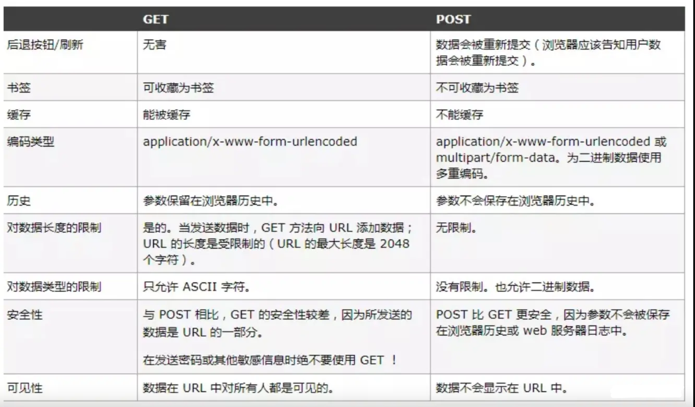

### 1. http/https 协议

- 1.0 协议缺陷:
  - 无法复用链接，完成即断开，**重新慢启动和 TCP 3次握手**
  - head of line blocking: **线头阻塞**，导致请求之间互相影响
- 1.1 改进:
  - **长连接**(默认 keep-alive)，复用
  - host 字段指定对应的虚拟站点
  - 新增功能:
    - 断点续传
    - 身份认证
    - 状态管理
    - cache 缓存
      - Cache-Control
      - Expires
      - Last-Modified
      - Etag
- 2.0:
  - 多路复用
  - 二进制分帧层: 应用层和传输层之间
  - 首部压缩
  - 服务端推送
- https: 较为安全的网络传输协议
  - 证书(公钥)
  - SSL 加密
  - 端口 443
- TCP:
  - 三次握手
  - 四次挥手
  - 滑动窗口: 流量控制
  - 拥塞处理
    - 慢开始
    - 拥塞避免
    - 快速重传
    - 快速恢复
- 缓存策略: 可分为 **强缓存** 和 **协商缓存**
  - Cache-Control/Expires: 浏览器判断缓存是否过期，未过期时，直接使用强缓存，**Cache-Control的 max-age 优先级高于 Expires**
  - 当缓存已经过期时，使用协商缓存
    - 唯一标识方案: Etag(response 携带) & If-None-Match(request携带，上一次返回的 Etag): 服务器判断资源是否被修改，
    - 最后一次修改时间: Last-Modified(response) & If-Modified-Since (request，上一次返回的Last-Modified)
      - 如果一致，则直接返回 304 通知浏览器使用缓存
      - 如不一致，则服务端返回新的资源
  - Last-Modified 缺点：
    - 周期性修改，但内容未变时，会导致缓存失效
    - 最小粒度只到 s， s 以内的改动无法检测到
  - Etag 的优先级高于 Last-Modified

### 2. 常见状态码

- 1xx: 接受，继续处理

- 200: 成功，并返回数据

- 201: 已创建

- 202: 已接受

- 203: 成为，但未授权

- 204: 成功，无内容

- 205: 成功，重置内容

- 206: 成功，部分内容

- 301: 永久移动，重定向

- 302: 临时移动，可使用原有URI

- 304: 资源未修改，可使用缓存

- 305: 需代理访问

- 400: 请求语法错误

- 401: 要求身份认证

- 403: 拒绝请求

- 404: 资源不存在

- 500: 服务器错误

- > **2XX 成功**
  >
  > - 200 OK，表示从客户端发来的请求在服务器端被正确处理
  > - 204 No content，表示请求成功，但响应报文不含实体的主体部分
  > - 205 Reset Content，表示请求成功，但响应报文不含实体的主体部分，但是与 204 响应不同在于要求请求方重置内容
  > - 206 Partial Content，进行范围请求
  >
  > **3XX 重定向**
  >
  > - 301 moved permanently，永久性重定向，表示资源已被分配了新的 URL
  > - 302 found，临时性重定向，表示资源临时被分配了新的 URL
  > - 303 see other，表示资源存在着另一个 URL，应使用 GET 方法获取资源
  > - 304 not modified，表示服务器允许访问资源，但因发生请求未满足条件的情况
  > - 307 temporary redirect，临时重定向，和302含义类似，但是期望客户端保持请求方法不变向新的地址发出请求
  >
  > **4XX 客户端错误**
  >
  > - 400 bad request，请求报文存在语法错误
  > - 401 unauthorized，表示发送的请求需要有通过 HTTP 认证的认证信息
  > - 403 forbidden，表示对请求资源的访问被服务器拒绝
  > - 404 not found，表示在服务器上没有找到请求的资源
  >
  > **5XX 服务器错误**
  >
  > - 500 internal sever error，表示服务器端在执行请求时发生了错误
  > - 501 Not Implemented，表示服务器不支持当前请求所需要的某个功能
  > - 503 service unavailable，表明服务器暂时处于超负载或正在停机维护，无法处理请求

### 3. get / post

- get: 缓存、请求长度受限、会被历史保存记录
  - 无副作用(不修改资源)，幂等(请求次数与资源无关)的场景
- post: 安全、大数据、更多编码类型

两者详细对比如下图:





### 4. Websocket

Websocket 是一个 **持久化的协议**， 基于 http ， 服务端可以 **主动 push**

- 兼容：
  - FLASH Socket
  - 长轮询： 定时发送 ajax
  - long poll： 发送 --> 有消息时再 response
- `new WebSocket(url)`
- `ws.onerror = fn`
- `ws.onclose = fn`
- `ws.onopen = fn`
- `ws.onmessage = fn`
- `ws.send()`

### 5. TCP三次握手

建立连接前，客户端和服务端需要通过握手来确认对方:

- 客户端发送 syn(同步序列编号) 请求，进入 syn_send 状态，等待确认

- 服务端接收并确认 syn 包后发送 syn+ack 包，进入 syn_recv 状态

- 客户端接收 syn+ack 包后，发送 ack 包，双方进入 established 状态

- > 在 TCP 协议中，主动发起请求的一端为客户端，被动连接的一端称为服务端。不管是客户端还是服务端，TCP 连接建立完后都能发送和接收数据，所以 TCP 也是一个全双工的协议。
  >
  > 起初，两端都为 CLOSED 状态。在通信开始前，双方都会创建 TCB。 服务器创建完 TCB 后遍进入 LISTEN 状态，此时开始等待客户端发送数据。
  >
  > **第一次握手**
  >
  > 客户端向服务端发送连接请求报文段。该报文段中包含自身的数据通讯初始序号。请求发送后，客户端便进入  SYN-SENT 状态，`x` 表示客户端的数据通信初始序号。
  >
  > **第二次握手**
  >
  > 服务端收到连接请求报文段后，如果同意连接，则会发送一个应答，该应答中也会包含自身的数据通讯初始序号，发送完成后便进入 SYN-RECEIVED 状态。
  >
  > **第三次握手**
  >
  > 当客户端收到连接同意的应答后，还要向服务端发送一个确认报文。客户端发完这个报文段后便进入ESTABLISHED 状态，服务端收到这个应答后也进入 ESTABLISHED 状态，此时连接建立成功。
  >
  > PS：第三次握手可以包含数据，通过 TCP 快速打开（TFO）技术。其实只要涉及到握手的协议，都可以使用类似 TFO 的方式，客户端和服务端存储相同 cookie，下次握手时发出 cookie 达到减少 RTT 的目的。
  >
  > **你是否有疑惑明明两次握手就可以建立起连接，为什么还需要第三次应答？**
  >
  > 因为这是为了防止失效的连接请求报文段被服务端接收，从而产生错误。
  >
  > 可以想象如下场景。客户端发送了一个连接请求 A，但是因为网络原因造成了超时，这时 TCP 会启动超时重传的机制再次发送一个连接请求 B。此时请求顺利到达服务端，服务端应答完就建立了请求。如果连接请求 A 在两端关闭后终于抵达了服务端，那么这时服务端会认为客户端又需要建立 TCP 连接，从而应答了该请求并进入 ESTABLISHED 状态。此时客户端其实是 CLOSED 状态，那么就会导致服务端一直等待，造成资源的浪费。
  >
  > PS：在建立连接中，任意一端掉线，TCP 都会重发 SYN 包，一般会重试五次，在建立连接中可能会遇到 SYN FLOOD 攻击。遇到这种情况你可以选择调低重试次数或者干脆在不能处理的情况下拒绝请求。
  >
  > ### TCP 拥塞控制
  >
  > 拥塞处理和流量控制不同，后者是作用于接收方，保证接收方来得及接受数据。而前者是作用于网络，防止过多的数据拥塞网络，避免出现网络负载过大的情况。
  >
  > 拥塞处理包括了四个算法，分别为：慢开始，拥塞避免，快速重传，快速恢复。
  >
  > ### 慢开始算法
  >
  > 慢开始算法，顾名思义，就是在传输开始时将发送窗口慢慢指数级扩大，从而避免一开始就传输大量数据导致网络拥塞。
  >
  > 慢开始算法步骤具体如下
  >
  > 1. 连接初始设置拥塞窗口（Congestion Window） 为 1 MSS（一个分段的最大数据量）
  > 2. 每过一个 RTT 就将窗口大小乘二
  > 3. 指数级增长肯定不能没有限制的，所以有一个阈值限制，当窗口大小大于阈值时就会启动拥塞避免算法。
  >
  > ### 拥塞避免算法
  >
  > 拥塞避免算法相比简单点，每过一个 RTT 窗口大小只加一，这样能够避免指数级增长导致网络拥塞，慢慢将大小调整到最佳值。
  >
  > 在传输过程中可能定时器超时的情况，这时候 TCP 会认为网络拥塞了，会马上进行以下步骤：
  >
  > - 将阈值设为当前拥塞窗口的一半
  > - 将拥塞窗口设为 1 MSS
  > - 启动拥塞避免算法
  >
  > ### 快速重传
  >
  > 快速重传一般和快恢复一起出现。一旦接收端收到的报文出现失序的情况，接收端只会回复最后一个顺序正确的报文序号（没有 Sack 的情况下）。如果收到三个重复的 ACK，无需等待定时器超时再重发而是启动快速重传。具体算法分为两种：
  >
  > **TCP Taho 实现如下**
  >
  > - 将阈值设为当前拥塞窗口的一半
  > - 将拥塞窗口设为 1 MSS
  > - 重新开始慢开始算法
  >
  > **TCP Reno 实现如下**
  >
  > - 拥塞窗口减半
  > - 将阈值设为当前拥塞窗口
  > - 进入快恢复阶段（重发对端需要的包，一旦收到一个新的 ACK 答复就退出该阶段）
  > - 使用拥塞避免算法
  >
  > ### TCP New Ren 改进后的快恢复
  >
  > **TCP New Reno** 算法改进了之前 **TCP Reno** 算法的缺陷。在之前，快恢复中只要收到一个新的 ACK 包，就会退出快恢复。
  >
  > 在 **TCP New Reno** 中，TCP 发送方先记下三个重复 ACK 的分段的最大序号。
  >
  > 假如我有一个分段数据是 1 ~ 10 这十个序号的报文，其中丢失了序号为 3 和 7 的报文，那么该分段的最大序号就是 10。发送端只会收到 ACK 序号为 3 的应答。这时候重发序号为 3 的报文，接收方顺利接收并会发送 ACK 序号为 7 的应答。这时候 TCP 知道对端是有多个包未收到，会继续发送序号为 7 的报文，接收方顺利接收并会发送 ACK 序号为 11 的应答，这时发送端认为这个分段接收端已经顺利接收，接下来会退出快恢复阶段。
  >
  > ### HTTPS 握手
  >
  > HTTPS 还是通过了 HTTP 来传输信息，但是信息通过 TLS 协议进行了加密。
  >
  > ## TLS
  >
  > TLS 协议位于传输层之上，应用层之下。首次进行 TLS 协议传输需要两个 RTT ，接下来可以通过 Session Resumption 减少到一个 RTT。
  >
  > 在 TLS 中使用了两种加密技术，分别为：对称加密和非对称加密。
  >
  > **对称加密**：
  >
  > 对称加密就是两边拥有相同的秘钥，两边都知道如何将密文加密解密。
  >
  > **非对称加密**：
  >
  > 有公钥私钥之分，公钥所有人都可以知道，可以将数据用公钥加密，但是将数据解密必须使用私钥解密，私钥只有分发公钥的一方才知道。
  >
  > **TLS 握手过程如下图：**
  >
  > 
  >
  > 
  >
  > 
  >
  > 1. 客户端发送一个随机值，需要的协议和加密方式
  > 2. 服务端收到客户端的随机值，自己也产生一个随机值，并根据客户端需求的协议和加密方式来使用对应的方式，发送自己的证书（如果需要验证客户端证书需要说明）
  > 3. 客户端收到服务端的证书并验证是否有效，验证通过会再生成一个随机值，通过服务端证书的公钥去加密这个随机值并发送给服务端，如果服务端需要验证客户端证书的话会附带证书
  > 4. 服务端收到加密过的随机值并使用私钥解密获得第三个随机值，这时候两端都拥有了三个随机值，可以通过这三个随机值按照之前约定的加密方式生成密钥，接下来的通信就可以通过该密钥来加密解密
  >
  > 通过以上步骤可知，在 TLS 握手阶段，两端使用非对称加密的方式来通信，但是因为非对称加密损耗的性能比对称加密大，所以在正式传输数据时，两端使用对称加密的方式通信。
  >
  > PS：以上说明的都是 TLS 1.2 协议的握手情况，在 1.3 协议中，首次建立连接只需要一个 RTT，后面恢复连接不需要 RTT 了。
  >
  > ### 从输入 URL 到页面加载全过程
  >
  > 1. 首先做 DNS 查询，如果这一步做了智能 DNS 解析的话，会提供访问速度最快的 IP 地址回来
  > 2. 接下来是 TCP 握手，应用层会下发数据给传输层，这里 TCP 协议会指明两端的端口号，然后下发给网络层。网络层中的 IP 协议会确定 IP 地址，并且指示了数据传输中如何跳转路由器。然后包会再被封装到数据链路层的数据帧结构中，最后就是物理层面的传输了
  > 3. TCP 握手结束后会进行 TLS 握手，然后就开始正式的传输数据
  > 4. 数据在进入服务端之前，可能还会先经过负责负载均衡的服务器，它的作用就是将请求合理的分发到多台服务器上，这时假设服务端会响应一个 HTML 文件
  > 5. 首先浏览器会判断状态码是什么，如果是 200 那就继续解析，如果 400 或 500 的话就会报错，如果 300 的话会进行重定向，这里会有个重定向计数器，避免过多次的重定向，超过次数也会报错
  > 6. 浏览器开始解析文件，如果是 gzip 格式的话会先解压一下，然后通过文件的编码格式知道该如何去解码文件
  > 7. 文件解码成功后会正式开始渲染流程，先会根据 HTML 构建 DOM 树，有 CSS 的话会去构建 CSSOM 树。如果遇到 `script` 标签的话，会判断是否存在 `async` 或者 `defer` ，前者会并行进行下载并执行 JS，后者会先下载文件，然后等待 HTML 解析完成后顺序执行，如果以上都没有，就会阻塞住渲染流程直到 JS 执行完毕。遇到文件下载的会去下载文件，这里如果使用 HTTP 2.0 协议的话会极大的提高多图的下载效率。
  > 8. 初始的 HTML 被完全加载和解析后会触发 `DOMContentLoaded` 事件
  > 9. CSSOM 树和 DOM 树构建完成后会开始生成 Render 树，这一步就是确定页面元素的布局、样式等等诸多方面的东西
  > 10. 在生成 Render 树的过程中，浏览器就开始调用 GPU 绘制，合成图层，将内容显示在屏幕上了

### 6. TCP四次挥手

- 客户端 -- FIN --> 服务端， FIN—WAIT
- 服务端 -- ACK --> 客户端， CLOSE-WAIT
- 服务端 -- ACK,FIN --> 客户端， LAST-ACK
- 客户端 -- ACK --> 服务端，CLOSED

### 7. Node 的 Event Loop: 6个阶段

- timer 阶段: 执行到期的`setTimeout / setInterval`队列回调

- I/O 阶段: 执行上轮循环残流的`callback`

- idle, prepare

- poll: 等待回调

  - 1. 执行回调

  - 1. 执行定时器

    - 如有到期的`setTimeout / setInterval`， 则返回 timer 阶段
    - 如有`setImmediate`，则前往 check 阶段

- check

  - 执行`setImmediate`

- close callbacks

### 8. Ajax 是什么? 如何创建一个Ajax？

```
ajax的全称：Asynchronous Javascript And XML。
异步传输+js+xml。
所谓异步，在这里简单地解释就是：向服务器发送请求的时候，我们不必等待结果，而是可以同时做其他的事情，等到有了结果它自己会根据设定进行后续操作，与此同时，页面是不会发生整页刷新的，提高了用户体验。

(1)创建XMLHttpRequest对象,也就是创建一个异步调用对象
(2)创建一个新的HTTP请求,并指定该HTTP请求的方法、URL及验证信息
(3)设置响应HTTP请求状态变化的函数
(4)发送HTTP请求
(5)获取异步调用返回的数据
(6)使用JavaScript和DOM实现局部刷新

```

### 9. 是否了解公钥加密和私钥加密。

```
一般情况下是指私钥用于对数据进行签名，公钥用于对签名进行验证;
HTTP网站在浏览器端用公钥加密敏感数据，然后在服务器端再用私钥解密。

```

### 10. WEB应用从服务器主动推送Data到客户端有那些方式？

```
html5提供的Websocket
不可见的iframe
WebSocket通过Flash
XHR长时间连接
XHR Multipart Streaming
```


### 11.跨域

> 因为浏览器出于安全考虑，有同源策略。也就是说，如果协议、域名或者端口有一个不同就是跨域，Ajax 请求会失败。

- 我们可以通过以下几种常用方法解决跨域的问题

  #### JSONP

  JSONP 的原理很简单，就是利用 `<script>` 标签没有跨域限制的漏洞。通过 `<script>` 标签指向一个需要访问的地址并提供一个回调函数来接收数据当需要通讯时。

  ```
  <script src="http://domain/api?param1=a&param2=b&callback=jsonp"></script>
  <script>
      function jsonp(data) {
      	console.log(data)
  	}
  </script>    
  复制代码
  ```

  JSONP 使用简单且兼容性不错，但是只限于 `get` 请求。

  在开发中可能会遇到多个 JSONP 请求的回调函数名是相同的，这时候就需要自己封装一个 JSONP，以下是简单实现

  ```js
  function jsonp(url, jsonpCallback, success) {
    let script = document.createElement("script");
    script.src = url;
    script.async = true;
    script.type = "text/javascript";
    window[jsonpCallback] = function(data) {
      success && success(data);
    };
    document.body.appendChild(script);
  }
  jsonp(
    "http://xxx",
    "callback",
    function(value) {
      console.log(value);
    }
  );
  复制代码
  ```

  #### CORS

  CORS需要浏览器和后端同时支持。IE 8 和 9 需要通过 `XDomainRequest` 来实现。

  浏览器会自动进行 CORS 通信，实现CORS通信的关键是后端。只要后端实现了 CORS，就实现了跨域。

  服务端设置 `Access-Control-Allow-Origin` 就可以开启 CORS。 该属性表示哪些域名可以访问资源，如果设置通配符则表示所有网站都可以访问资源。

  #### document.domain

  该方式只能用于二级域名相同的情况下，比如 `a.test.com` 和 `b.test.com` 适用于该方式。

  只需要给页面添加 `document.domain = 'test.com'` 表示二级域名都相同就可以实现跨域

  #### postMessage

  这种方式通常用于获取嵌入页面中的第三方页面数据。一个页面发送消息，另一个页面判断来源并接收消息

  ```js
  // 发送消息端
  window.parent.postMessage('message', 'http://test.com');
  // 接收消息端
  var mc = new MessageChannel();
  mc.addEventListener('message', (event) => {
      var origin = event.origin || event.originalEvent.origin; 
      if (origin === 'http://test.com') {
          console.log('验证通过')
      }
  });
  
  ```

  

### 12. 安全

- XSS攻击: 注入恶意代码
  - cookie 设置 httpOnly
  - 转义页面上的输入内容和输出内容
- CSRF: 跨站请求伪造，防护:
  - get 不修改数据
  - 不被第三方网站访问到用户的 cookie
  - 设置白名单，不被第三方网站请求
  - 请求校验

## 
